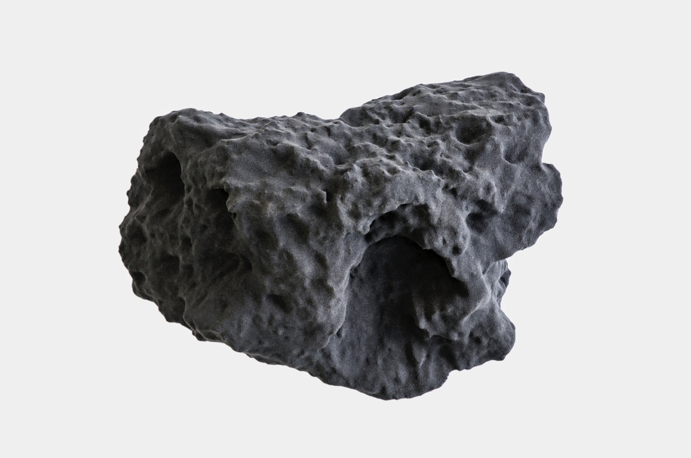
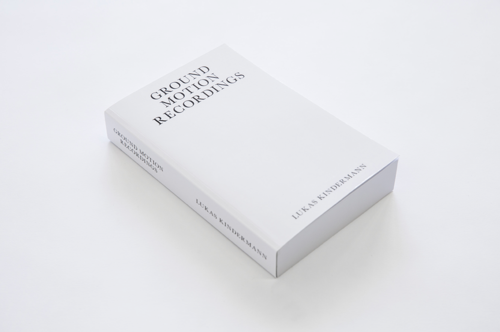

The sky, as familiar as it is to us, seems infinite and astronomical. Its time is measured in the movement of\
the clouds, the weather, wind and thunder, shades of sky- blue and endless dark, dust particles, blazing comets, and fallen stars. This poetic beyond our fingertips, the ultimate existential question asked of us, allows the world to appear weightless.

1:1, a 3D-printed replica of the Block Island meteorite located several hundred million kilometres away on Mars, reverts this thought by fixing the image of a fallen piece of atmospheric matter as a monument to recorded data. The replica meteorite weighs 37 kg and is based on a 3D model made

by NASA from images taken by the Mars Rover Opportunity. The weighted 1:1 reproduction from the sky, along with Lukas Kindermann ́s Fallen Stars, Hydrographic Marble CS 43-3, Ground Motion Recordings or his Mimaki CG-60 SR Series of abstract pen-plotter line drawings, ritually strip the subject of romanticism by shifting the context and asserting the chaotic nature of digital patterns.

The deliberate acts of rendering knowledge, information and recorded memory become Kindermann ́s subject; minimal and abstract versions of original representations. In the space between the actual and the replica the spark ignites. The dimensional metaphor stands in not only as an artificial measurement, but the place where idea and reality converge. Whether as a glossy marbled rock, or a precision-made

relic, the patterns in flux reveal haptic coincidences guided by the artist himself and the natural faults of the equipment he chooses to utilize, the 3D printer, drawing plotter and seismographic printing. The results are not homogenous, but rather an open rehearsal with the concrete, real, material and quantifiable sides of rather conceptual forms of observation.

In this way Lukas Kindermann ́s field studies resonate soundly today while the finite digital replicas begin to represent time passing in analog; reminding us we are in fact impermanent fragments in the mercurial stardust sky.